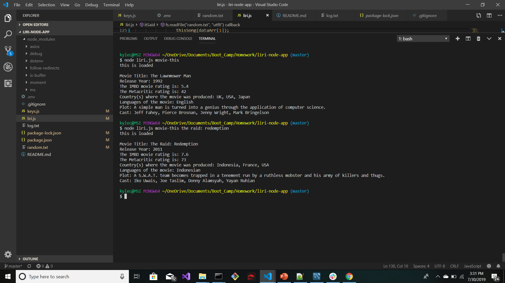
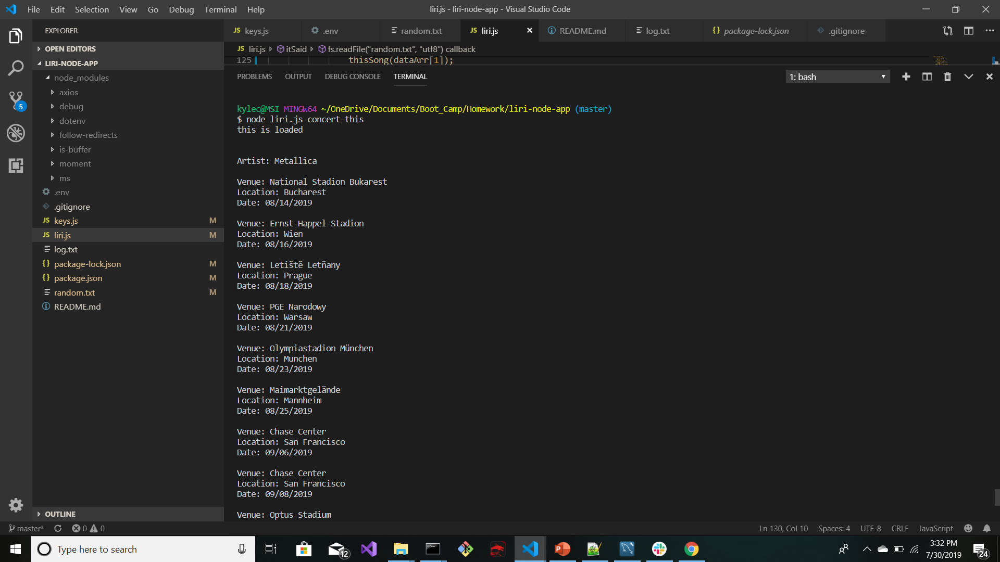
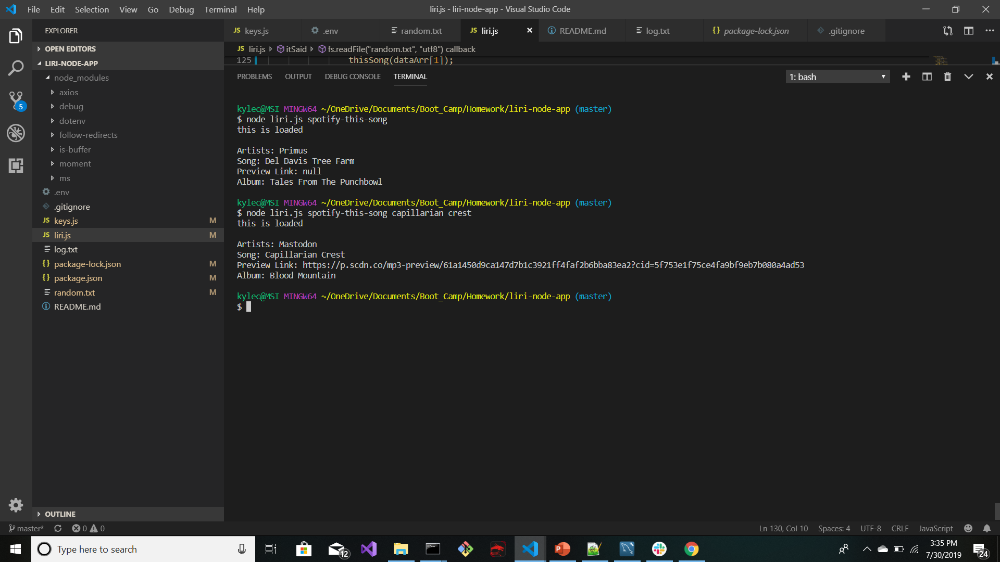

# liri-node-app

 LIRI is a language interpretation and recognition interface functioning as a command line node application capable of receiving input parameters and returns relative data. LIRI searches and retrieves media data utilizing API's provided by Axios Spotify, OMDB, BandsInTown,
and others. 

Required npm packages:
- Axios
- Spotify
- Moment
- Dotenv

# Movie This

- No input value retrieves media data for the default value (The Lawnmower Man).
- User input (the raid: redemption), media data specific to the input value is retrieved and displayed.

# Concert This

-User input (twenty one pilots), media data specific to the input value is retrieved and displayed.

# Spotify This Song

-User input (del davis tree farm), media data specific to the input value is retrieved and displayed.

# Do What It Says

- The command line output is conditional upon the search query and command. The command reads the input from the random.txt file as a substitute for user input. Media data specific to the input read from the random.text file is retrieved and displayed.

